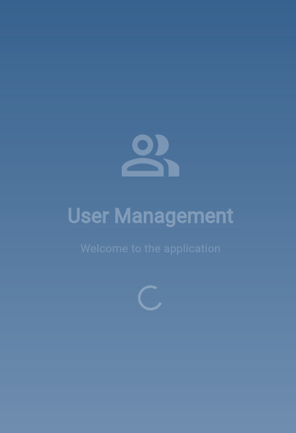
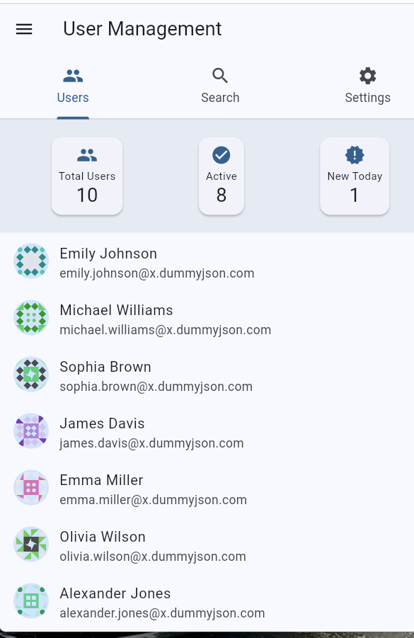
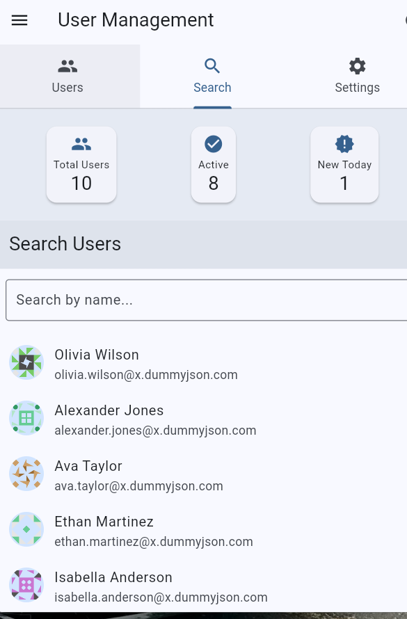
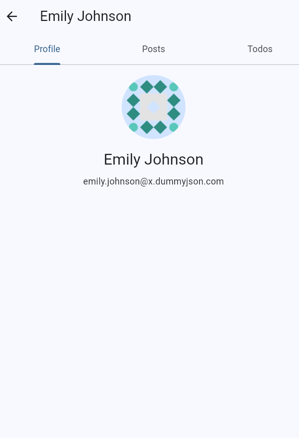
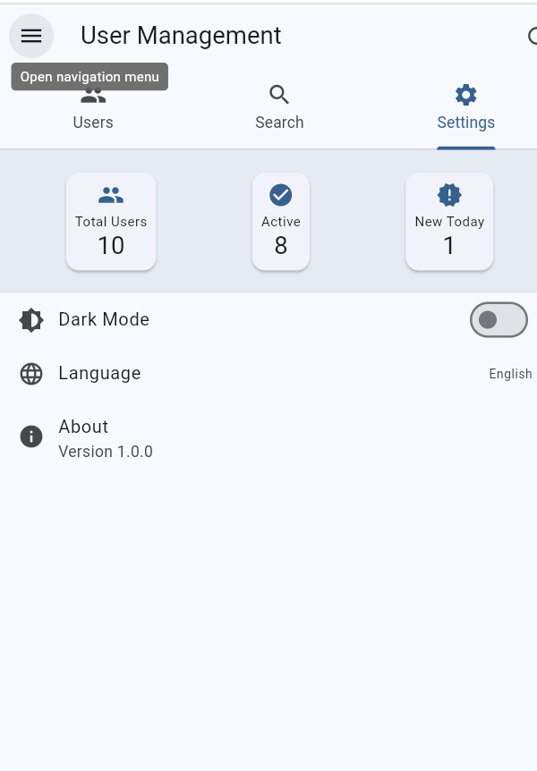

# Flutter User Management App

A comprehensive Flutter application demonstrating modern app development practices with BLoC pattern, REST API integration, and clean architecture.

## Project Overview

This project is a user management application that showcases best practices in Flutter development, including:
- State management with BLoC pattern
- REST API integration with pagination
- Clean architecture principles
- Modern UI design with Material 3

## Requirements Implementation

### 1. API Integration ✅
- Integration with DummyJSON Users API
- Implemented pagination using limit/skip parameters
- Real-time search functionality by user name
- Infinite scrolling in user list
- Nested API calls for user posts and todos

### 2. BLoC State Management ✅
- Implemented using flutter_bloc package
- Proper state handling (Loading, Success, Error)
- Separate events for different operations
- Efficient nested data management

### 3. UI Features ✅
- User List with avatars and details
- Real-time search implementation
- Detailed user profile view
- Posts and todos management
- Loading indicators and error handling
- Responsive and user-friendly design

### 4. Code Quality ✅
- Clean architecture implementation
- Proper folder structure
- Error handling and edge cases
- Flutter/Dart best practices

### 5. Bonus Features ✅
- Pull-to-refresh functionality
- Offline data caching
- Theme switching (Light/Dark)

## Technical Details

### API Endpoints
```
Base URL: https://dummyjson.com
- Users: /users?limit={limit}&skip={skip}
- Search: /users/search?q={query}
- User Posts: /posts/user/{userId}
- User Todos: /todos/user/{userId}
```

### Project Structure
```
lib/
├── blocs/          # BLoC pattern implementation
├── models/         # Data models
├── screens/        # UI screens
├── services/       # API and local storage services
└── utils/         # Helper functions and constants
```

### Core Features
1. User Management
   - View user list with pagination
   - Search users in real-time
   - View detailed user profiles

2. Post Management
   - View user posts
   - Create new posts
   - Manage post interactions

3. Todo Management
   - View user todos
   - Track todo completion status

## Getting Started

### Prerequisites
- Flutter SDK (latest stable version)
- Dart SDK
- Android Studio / VS Code
- Android Emulator / iOS Simulator

### Installation
1. Clone the repository
```bash
git clone https://github.com/yourusername/flutter_user_management_app.git
```

2. Install dependencies
```bash
flutter pub get
```

3. Run the application
```bash
flutter run
```

## Architecture

### BLoC Pattern Implementation
- Clear separation of UI and business logic
- Predictable state management
- Efficient data flow

### Data Flow
```
UI → Events → BLoC → States → UI
         ↑            ↓
      Repository    API
```

### Error Handling
- Comprehensive error catching
- User-friendly error messages
- Graceful degradation

## Testing
- Unit tests for BLoC logic
- Widget tests for UI components
- Integration tests for API calls

## Performance Optimization
- Lazy loading
- Image caching
- Efficient state management
- Minimal rebuilds

## Contributing
Contributions are welcome! Please read our contributing guidelines before submitting PRs.

## License
This project is licensed under the MIT License - see the LICENSE file for details.

## App Preview

### Video Demo


### Screenshots

<div style="display: flex; flex-wrap: wrap; gap: 10px;">

#### Welcome Screen


#### Home Dashboard


#### User List
"

#### Search Feature
" 

#### User Details
" 

#### Settings
" 
</div>

### Key Features Demonstrated
- Material 3 Design
- Smooth Animations
- Responsive Layout
- Dark/Light Theme
- Infinite Scrolling
- Real-time Search
